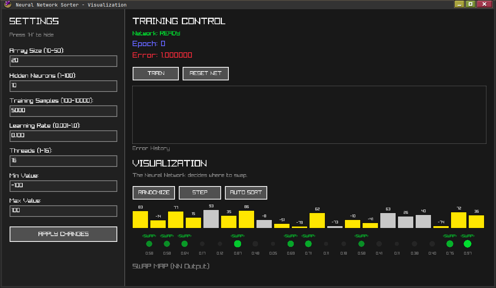

Neural Network Sorter (C Implementation)

A lightweight, scratch-built Neural Network library in C that learns to sort arrays by observation.

This project demonstrates a neural network learning the concept of "sorting" by outputting a Swap Map—decisions on which adjacent elements to swap—without any hardcoded sorting logic.



## Quick Start

To run on linux

```console
$ ./build.sh
```
